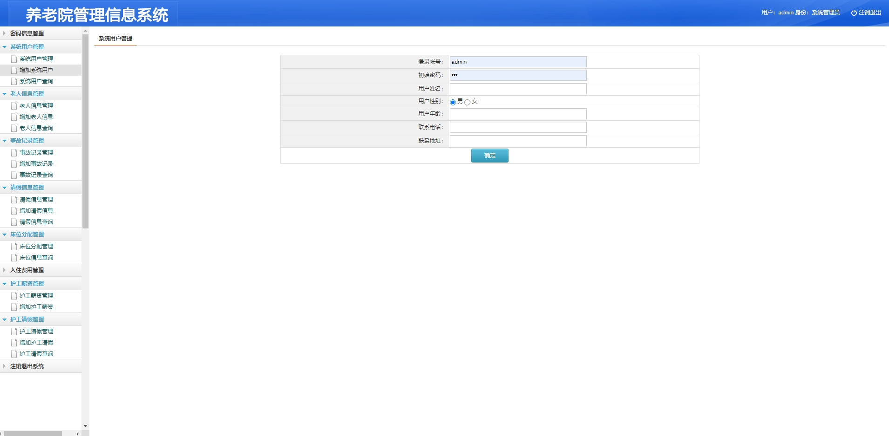
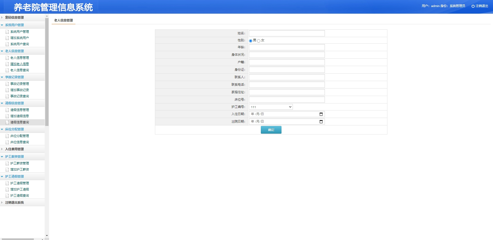
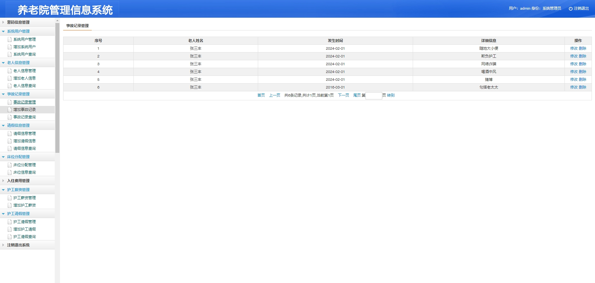
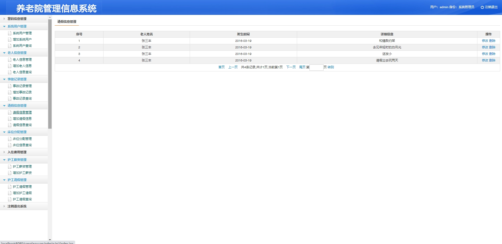
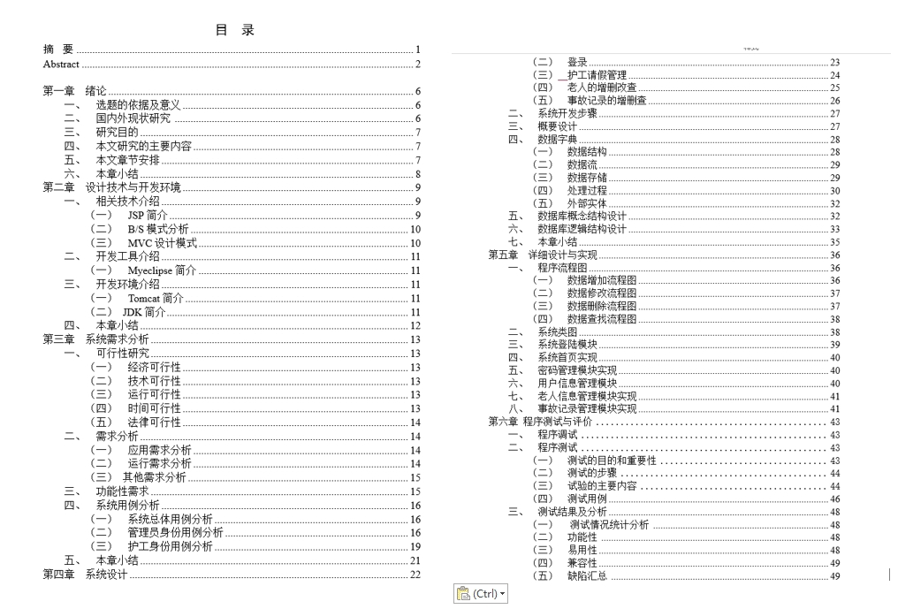

**郑重声明：项目经过本地测试，确保可以运行。项目仅供学习和毕业设计参考~**

[点我获取源码](https://x-x.fun/e/UZ796a4988Dkb)💕🤞

#### 1.项目介绍
 本项目主要是针对敬老院工作人员即管理员和员工设计的。敬老院管理系统将IT技术为养老院提供一个接口便于管理信息,存储老人个人信息和其他信息,查找和更新信息的养老院档案,节省了员工的劳动时间,大大降低了成本。

其主要功能包括：

- 系统管理员用户功能介绍：
- 用户管理员、员工登录、老人信息管理、床位分配管理、护工薪资管理、护工请假记录、老人请假记录、入住费用和事故记录管理。
- 普通管理员用户 （护工身份）功能介绍：
- 密码信息管理用例分析, 老人信息查看用例分析, 请假信息查看用例分析, 护工薪资查看用例分析。

#### 2.本地部署

- 创建数据库yanglaoyuan，导入项目中的sql文件
- 根据本地数据库环境，修改src/com/util/DBO.java下35行数据库连接信息
- 创建本地Tomcat server，并启动
- 登录： http://localhost:8080/yanglaoyuan/  管理员账号密码： admin/123  护工账号密码： 111/111

#### 3.项目部分截图
